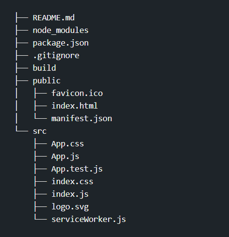

# File Structure React App

- React app contains three main folders 
    1. node_modules : it contains all the modules that is nedded to create and execute react app 
    2. public : it contains all the files or items that are support an app to create like images, static web pages, icons, favicons etc.
        - favicon.ico : it is icon which display with title of webpage on browser.
        - index.html : it is an important file that index.js can use using root element id
        - manifest : this file contains all the information related to the react application all the dependecies, icon, icon size and all other information.
    3. src : it is the main folder that contains file that directly render by the localhost:3000
        - app.css : this file gives css style to app.js file 
        - app.js : this is app file which we get default when create an react app 
        - app.test.js : this file contains all the test cases by which we can test our app in future to judge wheather it work fine with the boundry conditions.
        - index.css : this file provide css to index.js
        - index.js : this is the main file called by localhost:3000 server and store main render DOM call 
        -logo.svg : this is Scalable Vector Graphics file which contains the logo of Reactjs. By this file, we are able to see ReactJS logo on the browser
        - service Worker.js : as its name applies, it is important for registering a service which is generated automatically and creates Progressive Web Apps which are necessary for mobile React Native apps.

